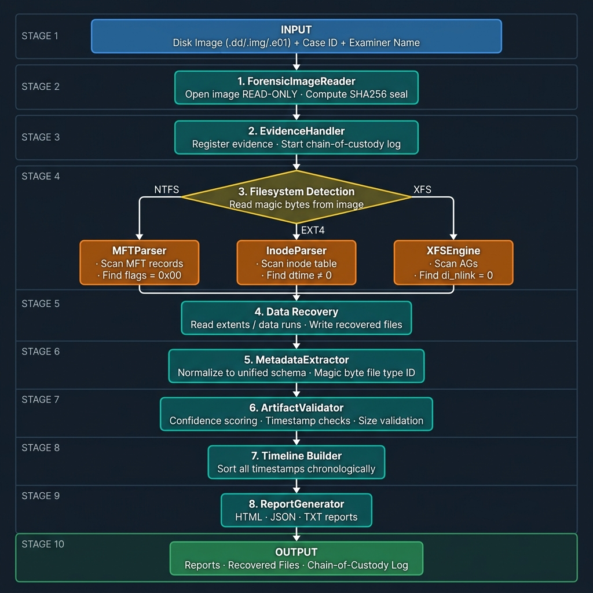
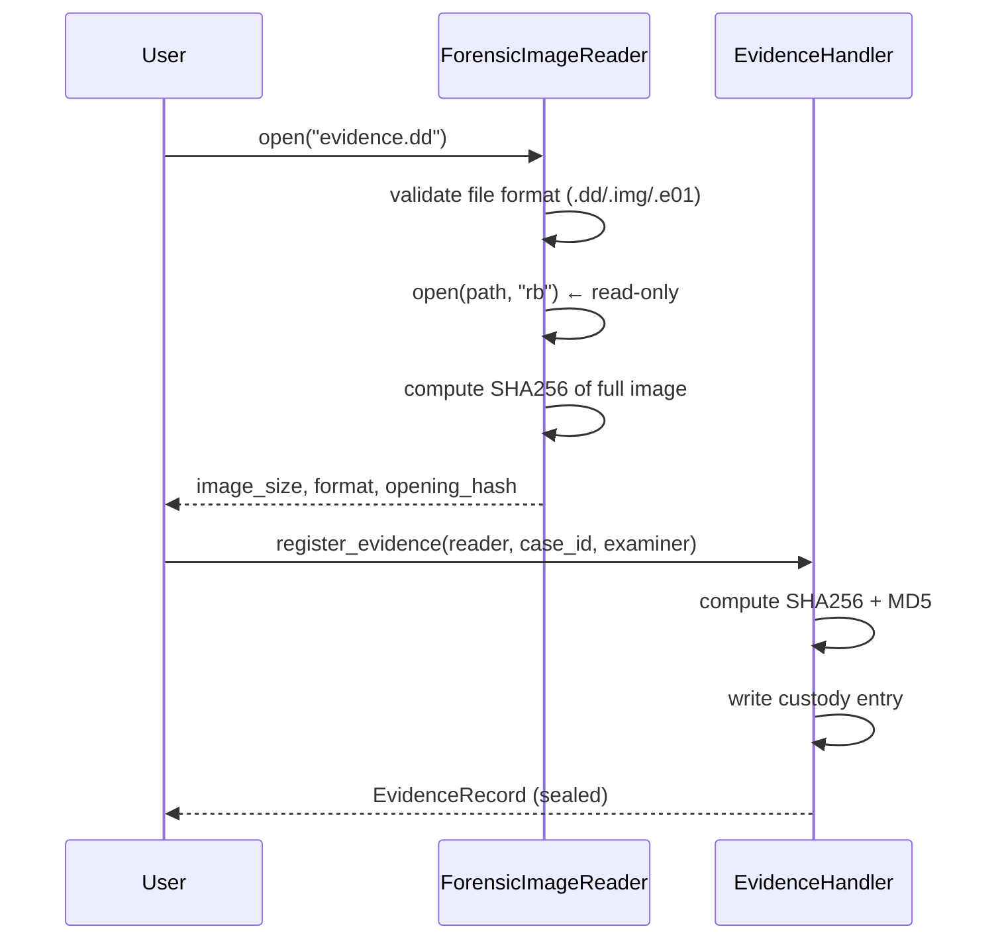
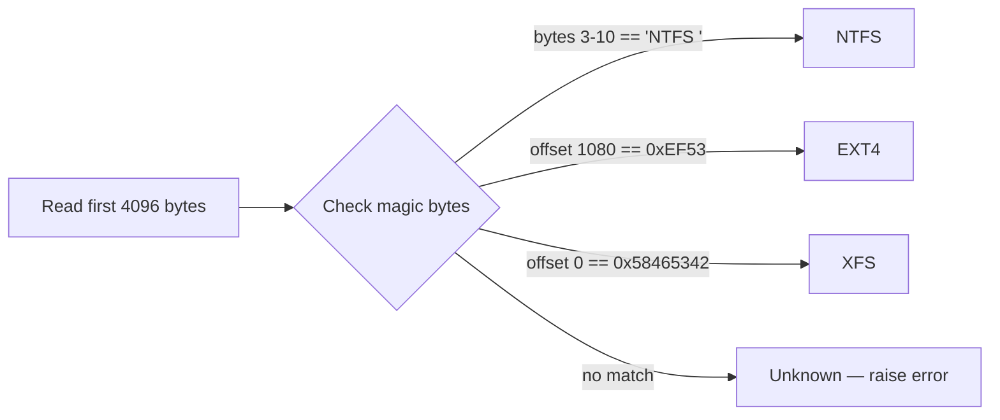
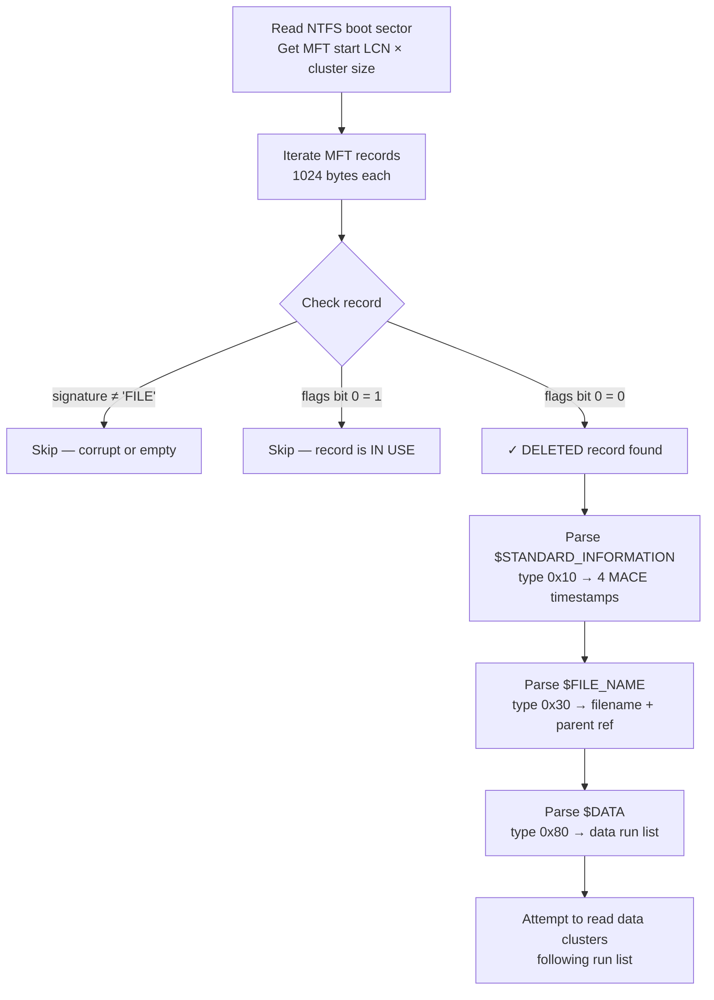
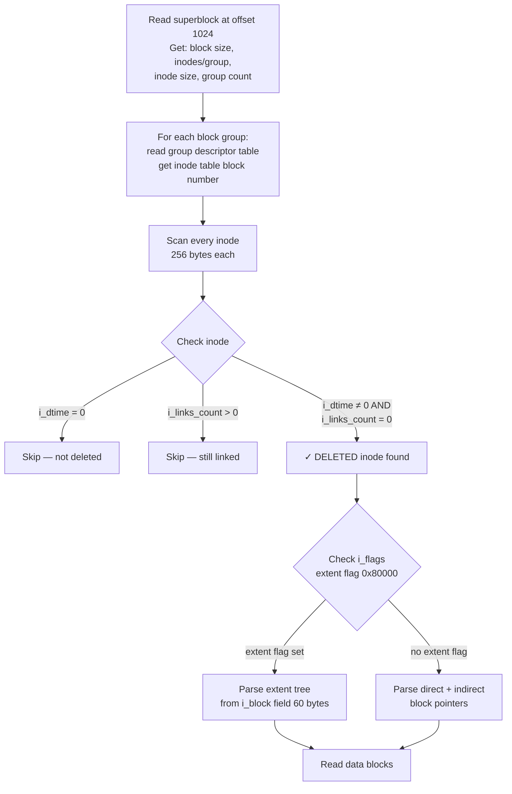
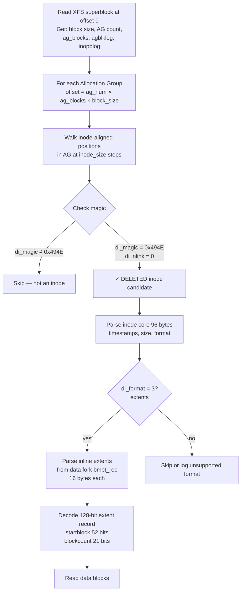
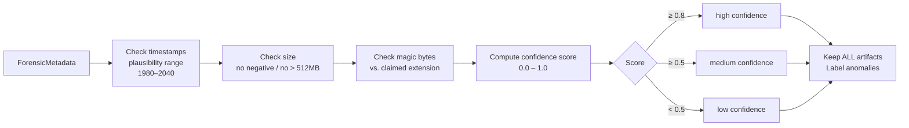
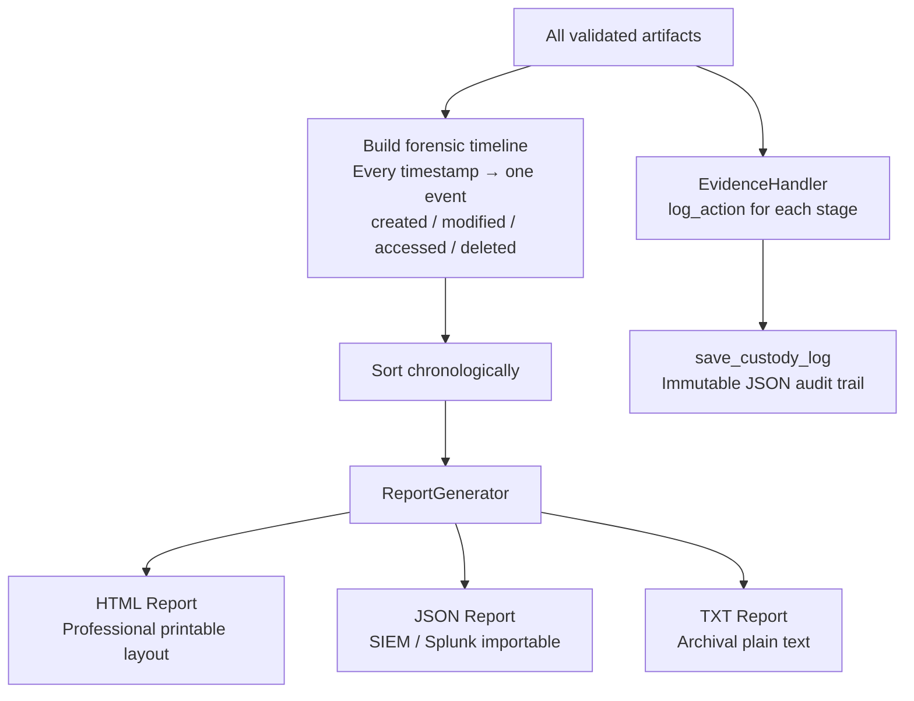
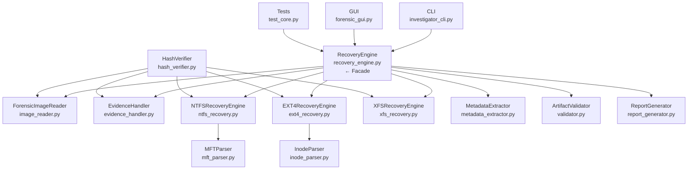

# Deleted File Recovery Forensics Tool

> **Production-quality DFIR platform for recovering deleted files from raw forensic disk images.**
> Supports **NTFS** (Windows), **EXT4** (Linux), and **XFS** (Enterprise Linux / RHEL).
> Designed for SOC analysts, DFIR engineers, and Incident Responders.

---

## Table of Contents

1. [What This Tool Does](#what-this-tool-does)
2. [How to Use It — Input & Output](#how-to-use-it--input--output)
3. [End-to-End Workflow](#end-to-end-workflow)
4. [How Deletion Recovery Works](#how-deletion-recovery-works)
5. [Architecture](#architecture)
6. [Project Structure](#project-structure)
7. [Quick Start](#quick-start)
8. [Forensic Principles](#forensic-principles)
9. [Technologies](#technologies)

---

## What This Tool Does

When a file is deleted from a filesystem, the operating system does **not** immediately zero out the data. It simply marks the space as "available for reuse." Until that space is overwritten, the original file's metadata — and often its data — remains on disk.

This tool exploits that window to recover deleted files from forensic disk images.

```
┌─────────────────────────────────────────────────────────────────┐
│                    The Core Principle                           │
│                                                                 │
│   File deleted  →  Metadata & data persist on disk              │
│                    (until overwritten by new files)             │
│                                                                 │
│   This tool reads that metadata, reconstructs what existed,     │
│   and exports a full forensic report — without ever touching    │
│   the original evidence image.                                  │
└─────────────────────────────────────────────────────────────────┘
```

### Capability Overview

| Category | Capability |
|---|---|
| **Filesystems** | NTFS (MFT parsing) · EXT4 (Inode table scanning) · XFS (AG B-tree scanning) |
| **Image Formats** | Raw `.dd` `.img` `.raw` `.bin` + E01 (via optional pyewf) |
| **Recovery** | Resident data · Non-resident extents · Inline data blocks |
| **Integrity** | SHA256 + MD5 evidence hashing, integrity re-verification |
| **Chain of Custody** | JSON audit log — who did what, when, with what result |
| **Validation** | Confidence scoring · Timestamp consistency · Magic byte verification |
| **Interface** | CLI (argparse, pipeline-friendly) + PyQt6 GUI Dashboard |
| **Reports** | HTML (printable/court) · JSON (SIEM) · TXT (archival) |
| **Timeline** | Chronological event reconstruction from all recovered timestamps |

---

## How to Use It — Input & Output

### What You Provide

| Input | Required | Description | Example |
|-------|----------|-------------|---------|
| **Disk image** | ✅ | Bit-copy of a disk or partition | `evidence.dd`, `drive.e01` |
| **Case ID** | ✅ | Unique investigation identifier | `IR-2024-042` |
| **Examiner name** | ✅ | Name of the forensic analyst | `"Jane Smith"` |
| **Output directory** | ✅ | Where reports and files are written | `./reports` |
| **Filesystem type** | ❌ | Only if auto-detection should be overridden | `ntfs`, `ext4`, `xfs` |

### What You Get

```
output/
├── IR-2024-042_report.html        ← Professional printable report
├── IR-2024-042_report.json        ← Machine-readable (SIEM/Splunk)
├── IR-2024-042_report.txt         ← Plain-text archival copy
├── custody_IR-2024-042.json       ← Immutable chain-of-custody log
└── recovered/
    ├── ntfs_rec_42_document.pdf   ← Recovered file (with SHA256)
    ├── ntfs_rec_87_photo.jpg
    └── ...
```

### Entry Points

```bash
# CLI — run a full scan
python main.py scan --image evidence.dd --case IR-2024-042 --examiner "Jane Smith"

# GUI — open the visual dashboard
python main.py --gui

# Verify image integrity only
python main.py verify --image evidence.dd --verify-hash

# Show image metadata without scanning
python main.py info --image evidence.dd --json
```

---

## End-to-End Workflow

### High-Level Flow



The workflow of the Deleted File Recovery Forensics Tool is designed around a linear, court-admissible pipeline:

1. **Input Phase:** The investigator provides a forensic disk image (`.dd`, `.img`, or `.e01`) along with the Case ID and Examiner Name.
2. **Evidence Handling (Stages 1-2):** The image is strictly opened in **Read-Only** mode to prevent contamination. The `ForensicImageReader` immediately computes a SHA256 hash to "seal" the evidence, while the `EvidenceHandler` initiates an immutable chain-of-custody log to record every subsequent action.
3. **Filesystem Detection (Stage 3):** The tool reads the magic bytes from the disk's early sectors to automatically detect whether the image uses NTFS, EXT4, or XFS.
4. **Extraction & Recovery (Stages 4-5):** Based on the detection, the appropriate engine (`MFTParser`, `InodeParser`, or `XFSEngine`) scans for deleted record flags (like `dtime ≠ 0` or `di_nlink = 0`). It then attempts to read the surviving data runs or extents to extract the raw file content.
5. **Normalization & Validation (Stages 6-7):** The `MetadataExtractor` converts the raw filesystem-specific data into a unified schema and identifies the file type using magic bytes (bypassing file extensions). The `ArtifactValidator` then runs sanity checks (timestamp boundaries, size limits) to assign a Confidence Score (High, Medium, Low) to each artifact.
6. **Reporting (Stages 8-10):** All timestamps are sorted chronologically by the Timeline Builder. Finally, the `ReportGenerator` produces comprehensive reports in HTML, JSON, and TXT formats, alongside the exported recovered files and the final chain-of-custody audit log.

---

### Detailed Step-by-Step

#### Step 1–3 · Evidence Acquisition & Sealing



> **Why this matters:** The opening hash is the "seal." Any accidental modification to the image later would produce a different hash — detected immediately by `verify_integrity()`. This satisfies the **NIST SP 800-86** requirement for evidence integrity.

---

#### Step 4 · Filesystem Detection



Detection uses **magic bytes** — fixed byte sequences embedded in each filesystem's on-disk structures:

| Filesystem | Location | Magic |
|---|---|---|
| NTFS | Boot sector bytes 3–10 | `NTFS    ` (ASCII) |
| EXT4 | Superblock offset 56 (byte 1080) | `0xEF53` (little-endian) |
| XFS | AG 0 superblock offset 0 | `0x58465342` ("XFSB" big-endian) |

---

#### Step 5 · Filesystem-Specific Recovery

Each filesystem has its own deletion mechanism. Here's what the tool looks for:

##### NTFS — MFT Scanning



**Key insight:** NTFS sets `flags = 0x0000` on deletion (clears the in-use bit at offset `0x016` in the MFT record). The entire record — filename, timestamps, size, cluster locations — stays intact until the space is reused.

---

##### EXT4 — Inode Table Scanning



**Key insight:** EXT4 sets `i_dtime` (deletion timestamp, at inode offset `0x14`) to the current Unix time on deletion. This field being non-zero is the primary deletion indicator. Critically, EXT4 does **not** zero block pointers — making data recovery possible.

---

##### XFS — Allocation Group Scanning



**Key insight:** XFS has no `dtime` field. Instead, deleted inodes retain their magic (`0x494E = "IN"`) but have `di_nlink = 0`. The tool finds them by scanning AG space for valid inode magic combined with zero link count.

---

#### Step 6–7 · Normalization & Validation

All three filesystem engines produce different raw output. The **MetadataExtractor** normalizes them into a single `ForensicMetadata` schema:

```
NTFS DeletedFileRecord  ─┐
EXT4 DeletedInodeRecord  ├──► MetadataExtractor ──► ForensicMetadata
XFS  DeletedXFSInodeRecord ┘                        (unified schema)
```

The **ArtifactValidator** then scores each artifact:



> **Design decision:** Low-confidence artifacts are **never discarded**. A corrupted but partially readable bash script may still prove attacker activity. Everything is preserved and labeled.

---

#### Step 8–10 · Timeline, Reports & Custody Log



---

## How Deletion Recovery Works

### NTFS

```
User deletes file
        │
        ├─ MFT record flags → 0x0000  (in-use bit cleared)
        ├─ Clusters marked free in $Bitmap
        └─ Directory entry removed from parent $I30 index

What survives on disk until overwritten:
  ✓ MFT record (filename, 4 timestamps, size, data run list)
  ✓ Data clusters (if not yet reallocated)

Recovery method: scan MFT for records with flags bit 0 = 0
```

### EXT4

```
User deletes file
        │
        ├─ i_links_count → 0
        ├─ i_dtime → current Unix timestamp  ← deletion marker
        ├─ Inode marked free in inode bitmap
        └─ Data blocks marked free in block bitmap

What survives on disk until overwritten:
  ✓ Inode struct (size, mode, timestamps, extent tree pointers)
  ✗ Filename (stored in directory entry — overwritten quickly)
  ✓ Data blocks (if not yet reallocated)

Recovery method: scan inode table for i_dtime ≠ 0 AND i_links_count = 0
```

### XFS

```
User deletes file
        │
        ├─ di_nlink → 0
        ├─ Inode freed in AGI B-tree
        └─ Extents returned to AG freespace B-trees

What survives on disk until overwritten:
  ✓ Inode core (di_magic = 0x494E, size, timestamps, extent list)
  ✗ Filename (stored in directory B-tree — freed promptly)
  ✓ Data blocks (if not yet reallocated)

Recovery method: scan AG space for inode magic 0x494E with di_nlink = 0
```

---

## Architecture

The tool uses a **Facade Pattern** — `RecoveryEngine` is the single entry point that hides all filesystem complexity:



> Adding a new filesystem (e.g., BTRFS, APFS) requires only: a new engine file, a new detection rule in `image_reader.py`, and registration in `RecoveryEngine`. No other code changes needed.

---

## Project Structure

```
deleted-file-recovery-tool/
│
├── main.py                        # Entry point — CLI and GUI launcher
│
├── core/
│   ├── image_reader.py            # Read-only forensic image reader + FS detection
│   ├── evidence_handler.py        # Chain-of-custody management
│   ├── hash_verifier.py           # SHA256 / MD5 / SHA1 hashing utilities
│   ├── mft_parser.py              # NTFS MFT deleted record scanner
│   ├── ntfs_recovery.py           # NTFS file data recovery engine
│   ├── inode_parser.py            # EXT4 inode table scanner
│   ├── ext4_recovery.py           # EXT4 file data recovery engine
│   ├── xfs_recovery.py            # XFS AG scanner + recovery engine
│   ├── metadata_extractor.py      # Unified metadata normalization + magic bytes
│   ├── validator.py               # Forensic artifact validation + confidence scoring
│   ├── recovery_engine.py         # Orchestration facade (main API)
│   └── report_generator.py        # HTML / JSON / TXT report generation
│
├── cli/
│   └── investigator_cli.py        # argparse CLI: scan / verify / info subcommands
│
├── gui/
│   └── forensic_gui.py            # PyQt6 dashboard: evidence loader + results table
│
├── config/
│   └── settings.py                # All filesystem constants + configuration
│
├── tests/
│   └── test_core.py               # pytest suite — 35 tests, all passing
│
├── sample_images/
│   └── create_demo_images.py      # Synthetic NTFS/EXT4/XFS image generator
│
├── reports/                       # Generated investigation reports (gitignored)
├── logs/                          # Investigation audit logs (gitignored)
└── requirements.txt
```

---

## Quick Start

### Installation

```bash
git clone <repo>
cd deleted-file-recovery-tool
pip install -r requirements.txt
```

### Generate Demo Images

```bash
python sample_images/create_demo_images.py
```

### CLI Usage

```bash
# Run a full forensic scan
python main.py scan \
  --image sample_images/ntfs_demo.dd \
  --case IR-2024-001 \
  --examiner "J. Smith" \
  --format html,json

# Force filesystem type (skip auto-detection)
python main.py scan --image disk.img --filesystem xfs --case CASE-003 --examiner "A. Jones"

# Verify image integrity (re-hashes and compares)
python main.py verify --image evidence.dd --verify-hash

# Show image metadata as JSON
python main.py info --image evidence.dd --json
```

### GUI

```bash
python main.py --gui
```

### Run Tests

```bash
pytest tests/ -v --tb=short
```

---

## Forensic Principles

This tool is designed around **NIST SP 800-86** and **ACPO Good Practice Guide** guidelines:

| Principle | Implementation |
|---|---|
| **Read-only access** | Images opened with `open(path, "rb")` — the OS cannot write to an `rb` file descriptor |
| **Integrity sealing** | SHA256 hash computed on open; re-verified on close to detect any change |
| **Chain-of-custody** | Every operation logged with UTC timestamp, examiner ID, action, and result |
| **Non-destructive output** | Recovered files written only to a separate output directory |
| **Confidence labeling** | Low-confidence artifacts labeled but never discarded |
| **Reproducibility** | Same image + same case → same output, every time |

---

## Technologies

| Technology | Version | Role |
|---|---|---|
| Python | 3.11+ | Core implementation |
| PyQt6 / PyQt5 | 6.4+ / 5.15+ | GUI dashboard |
| `struct` (stdlib) | — | Binary filesystem parsing |
| `hashlib` (stdlib) | — | SHA256 / MD5 / SHA1 hashing |
| `argparse` (stdlib) | — | CLI framework |
| `logging` (stdlib) | — | Structured investigation logs |
| `pathlib` (stdlib) | — | Cross-platform path handling |
| `pytest` | 7.4+ | Test framework (35 tests) |
| `rich` (optional) | 13+ | Enhanced CLI output with colour |
| `pyewf` (optional) | — | E01 forensic image format support |

---

## License

Portfolio use. Built as a flagship DFIR demonstration project.
